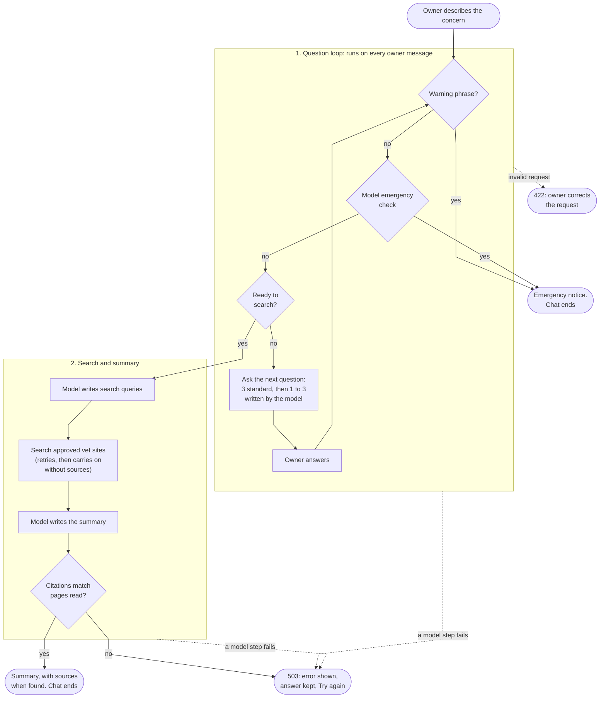

# VetAI

VetAI is a small demo built for a technical test ([the brief](e071501d-5c3c-4368-9565-a0ba2b94ce0c_Tech_Test.pdf)).
A pet owner describes a worry about their dog or cat. The app asks a few questions, looks up a
short list of approved veterinary websites, and gives back a summary to take to a vet, with links
to the pages it used. If anything sounds like an emergency, it stops and tells the owner to contact
an emergency vet now.

It is built with:

- **LangChain** for the four model steps;
- **Ollama**, which runs the language model on your own machine;
- **MLflow**, which records every chat turn: the prompts, the model's replies, and the timings;
- **FastAPI** for the backend, with a browser page and a desktop window as the two chat screens.

This is not a veterinary product. It does not diagnose, suggest medicines, or tell anyone their pet
is fine.

## Quickstart

You need:

- Python 3.11 or newer, and [uv](https://docs.astral.sh/uv/) to install it;
- [Ollama](https://ollama.com/), with about 13 GB of disk space and 16 GB of memory for the model;
- [Node.js](https://nodejs.org/) 18 or newer, only to build the browser page.

From the project folder:

```powershell
# 1. Download the model (once, about 13 GB)
ollama pull gpt-oss:20b

# 2. Install the Python dependencies (once)
uv sync --locked --extra desktop

# 3. Build the browser page (once)
cd src/frontend/public; npm install; npm run build; cd ../../..

# 4. Start the backend and leave it running
uv run uvicorn backend.app:app --host 127.0.0.1 --port 8000
```

Open http://127.0.0.1:8000, choose dog or cat, describe the concern, and answer the questions.
The first message can take up to a minute while Ollama loads the model into memory. After that,
questions come back in a few seconds. The last step searches the web and reads pages, so it takes
longer.

If something goes wrong:

- **The backend can't reach the model.** Ollama isn't running. Its desktop app normally starts it;
  otherwise run `ollama serve` in another terminal.
- **The summary says the source search didn't work.** The free web search sometimes stops
  answering for a short time. The app retries, then gives a summary based on general guidance
  with no links. Start a new chat later to get one with sources.
- **The last step shows an error.** The model's summary didn't pass the app's checks. Press
  **Try again**.
- **Windows: "The filename or extension is too long".** The project folder's path is too long for
  some installed files. Move the project to a shorter path, such as `C:\projects\VetAI`.

**Desktop window instead of the browser.** Skip step 3. With the backend running, open a second
terminal and run:

```powershell
uv run --extra desktop python -m frontend.local.app
```

**Check the install without the model.** `uv run pytest` runs the test suite in about 20 seconds.
It uses a stand-in model and fake search results, so it needs no Ollama and no network.

### Letting someone else try it

The browser page can be shared through a temporary public link, while the model keeps running on
your machine. With the backend running, install
[cloudflared](https://developers.cloudflare.com/cloudflare-one/connections/connect-networks/downloads/)
and run:

```powershell
cloudflared tunnel --url http://127.0.0.1:8000
```

It prints a `https://<random>.trycloudflare.com` address. No Cloudflare account is needed. The
address stops working when you stop the command. Anyone with the link can use your machine's model,
and there is no login or rate limit, so only run it while you need it.

## What happens in a chat

The backend keeps no memory between messages. Each time the owner sends something, the screen sends
the whole chat so far, and the backend works out what comes next.



1. **The owner starts.** They choose dog or cat and describe the concern in their own words.
2. **Emergency check, on every message.** First, plain Python code looks for a fixed list of
   warning phrases, such as "not breathing" or "ate chocolate". If none match, the model is asked
   one yes-or-no question: could these signs need an emergency vet now? If either says yes, the
   owner gets a fixed notice to contact an emergency vet, and the chat ends.
3. **Three standard questions.** How long has this been happening? Has it happened before? Is it
   constant, or does it come and go? These are fixed text in the code.
4. **One to three follow-up questions.** The model writes each one, based on the answers so far.
   It must ask at least one. The code counts them and stops after three.
5. **Search.** The model turns the answers into one to three short search queries. The app
   searches only six approved vet websites and reads up to four pages. If the search service
   doesn't answer, it retries after 1, 2 and 4 seconds.
6. **Summary.** The model writes the summary from those pages, and may add widely accepted general
   vet guidance that fits. It cites pages by ID, and the app checks that each ID is a page it
   actually read before building the list of links itself. If the search found nothing usable,
   the summary goes ahead on general guidance alone, with a notice saying the source search didn't
   work.

The owner then sees one of three outcomes:

| Outcome | What the owner sees |
| --- | --- |
| **Emergency** | A fixed notice to contact an emergency vet now |
| **Possible problem** | What they reported, points a vet may consider, things to watch or record, questions to ask the vet, and the sources used |
| **Nothing flagged** | The same sections without "points a vet may consider", and fixed wording that this is not an all-clear and they should see a vet if still worried |

The summary prompt tells the model to choose "possible problem" only when the owner reported
something abnormal. A web page about an illness is not enough on its own.

### The four model steps

Each step is a LangChain chain with its own prompt file in [`prompts/`](prompts/README.md):

| Step | Prompt file | What it does |
| --- | --- | --- |
| Emergency check | `emergency_check.md` | Says yes or no: could the signs need an emergency vet now? Told to say yes when unsure |
| Follow-up question | `adaptive_question.md` | Writes the next useful question, or says it has enough |
| Search queries | `search_queries.md` | Writes one to three short, neutral search queries |
| Summary | `evidence_synthesis.md` | Writes the summary from the retrieved pages, citing them, plus any fitting general guidance |

Every step must return a fixed structure (checked with Pydantic). Anything that doesn't fit is
rejected, never shown to the owner.

## See each turn in MLflow

Every message the owner sends is one MLflow run. With the backend running and at least one chat
done, start the MLflow screen from the project folder:

```powershell
uv run mlflow ui
```

Open http://127.0.0.1:5000 and choose the `vetai-chat` experiment.

- The **Runs** table has one row per turn: the model, a fingerprint of each prompt file (so runs
  made with different prompt text can be told apart), the time taken, and the kind of reply.
- The **Traces** tab shows each model call inside a turn, with the exact prompt, the reply, and how
  long it took.
- A failed turn is marked FAILED and says which step failed and why.

[`src/mlflow_tracking/README.md`](src/mlflow_tracking/README.md) lists everything that is recorded,
and has a short script that analyses the runs: turn times by model and reply kind, and which steps
fail and why.

## Key decisions and why

**Emergencies are checked first, on every message.** Spotting an emergency is the most important
job, so it runs before anything else each time the owner writes. It happens in two steps. First,
plain code looks for fixed warning phrases. This is instant and predictable, but it misses anything
worded differently: a pet's name, a misspelling, a sign it doesn't list. Second, the model checks
for those. The checks can only raise the alarm, never lower it: either one can end the chat with
the emergency notice, and neither can cancel the other. If the model check fails to answer, the
turn stops with an error instead of carrying on unchecked. A false alarm sends someone to a vet
they didn't need, which is the safer mistake. The model decides *whether* it's an emergency, never
the wording, so it can't soften the notice or add advice.

**A fixed workflow, not an agent.** An agent lets the model decide which step to take next. Here
the order is fixed in code: emergency check, three standard questions, follow-up questions,
search, summary. The code also owns the limit of three follow-up questions, the source list, and
the outcome wording. The model only fills in each step. This keeps every chat on a known, testable
path. It matters in practice: in testing, llama3 asked a fourth follow-up question even though the
prompt told it not to. A prompt is a request; code is a rule.

**Several small chains instead of one big prompt.** The follow-up questions and the web search are
there to show chains working together, each with one job and its own prompt: one checks for an
emergency, one asks questions, one writes search queries, one writes the summary. Each can be
tested, timed in MLflow, and changed on its own. They are four separate chains called by plain
Python, not one multi-step chain, because the owner answers between steps and most of what happens
in between (emergency phrases, question counting, web search, citation checks) isn't a model call.

**Approved sources first, general guidance allowed.** Search is limited to six vet organisations
listed in [`config/approved_sources.toml`](config/approved_sources.toml). The app checks the real
address of every result, and of any redirect, rather than trusting the search engine's site
filter. When pages are found, every point must cite one. The model cites pages by ID and the app
builds the links, so it can't invent a URL. The model may also add widely accepted general vet
guidance that fits the report and doesn't contradict the pages. A short outage of the free search
service shouldn't leave the owner with nothing, so a failed search gives a summary on general
guidance with a clear notice.

**Ollama through LangChain, so the provider can change.** The chains use LangChain's standard
chat-model interface, and the model is created in one place (`src/backend/model.py`). Moving to
OpenAI or Anthropic means swapping that one object for `ChatOpenAI` or `ChatAnthropic`, not
rewriting the chains. Running locally also means the owner's words stay on the machine (only the
short search queries go out) and no API key is needed.

**llama3 8B while building, gpt-oss:20b by default.** llama3 is quick, which made it good for
building and testing the flow. gpt-oss:20b is slower and a 13 GB download, but gives more
accurate answers, so it is the default. Any Ollama model can be set with
`VETAI_OLLAMA_MODEL`, but only gpt-oss:20b has been checked end to end. For gpt-oss, the backend
sets its reasoning effort to "low", so its thinking doesn't use up the space left for the answer.
The backend also sets the model's context window (how much text it reads at once) to 16,384
tokens. Ollama's default of about 2,000 silently cut the start off long summary prompts, removing
the rules and the owner's report.

**Backend and screens kept separate.** The browser page and the desktop window only talk to the
backend through one web address (`POST /v1/chat`), and neither contains any model or search code.
Either screen can be replaced without touching the backend. The backend keeps no memory between
messages, so it could be hosted on its own and run as several copies. The desktop window came
first, for working on this machine. The browser page was added so a reviewer can use the demo
through a link with nothing to install.

**No retries or fallback answers for model steps.** If a model step fails, the owner sees a plain
error, keeps their typed answer, and can press **Try again**. A made-up default medical answer would
be worse than an error. The web search is the exception, because its failures are usually short
outages: it retries with growing waits, then carries on without sources and says so.

**Recording never changes the reply.** If MLflow can't save a turn, the owner still gets their
answer and the problem goes to the server log.

## How the answers are checked

| Check | What it proves | When it runs |
| --- | --- | --- |
| Structured replies | Every model reply must match a fixed shape (Pydantic). A reply that doesn't is rejected and never shown | Every model call |
| Citation check | When pages were found, every point in the summary cites one the app actually read | Every summary |
| Test suite (`uv run pytest`) | The rules in code: emergency phrases, question order and limits, source checks, errors, MLflow recording. Uses a stand-in model | Any time, no model needed |
| Browser test | Whole chats through the real page and backend, with a stand-in model | Any time, needs Node |
| Emergency-check evaluation | The real model on 7 clear emergencies and 7 ordinary statements: all emergencies caught, no false alarms. Results saved to MLflow | Opt-in, needs Ollama |
| Recorded real chats | Full chats with the real model and live search, checked against written rules and saved for a person to review | Opt-in, needs Ollama and network |

Nothing yet uses a second model to grade the answers (often called "LLM as a judge"). That is in
future work below.

## Known limits

- **The phrase list is narrow.** It only matches the warning phrases it lists. The model check
  covers other wording, but neither is clinically validated.
- **Sources depend on a free search service.** DuckDuckGo sometimes stops answering for a while.
  The summary then has no links and relies on general guidance.
- **The model's summary doesn't always pass the app's checks.** The owner then sees an error and
  can try again. Repeated real-model runs are recorded under
  `artifacts/live-journeys/`; see [`tests/README.md`](tests/README.md).
- **The final step can outlast the screen's patience.** Both screens give up after 65 seconds.
  Search retries stop after 20 seconds to leave room for the summary, but a slow model can still
  run past the limit. The backend keeps working, and **Try again** starts the search again.
- **Page text includes site menus**, which takes space away from the useful content sent to the
  model.
- **The backend trusts the chat history it is sent.** It checks the three standard questions, but
  a custom client could change the follow-up questions.
- **MLflow stores what the owner typed.** The concern, the answers, the search queries and the page
  text sent to the model are kept in `mlflow.db` on this machine. Git ignores the file. Delete it to
  clear the history.

## Future work

**Docker.** `Dockerfile` and `compose.yaml` show how the backend and Ollama could run in
containers, but they are an untested example, not a deployment. To make them real: pin the Ollama
image version, keep `mlflow.db` on a volume, test `docker compose up` automatically, and add a
login and rate limits before exposing it anywhere.

**Interface fixes.**

- In the browser, pasted text over 1,000 characters is silently cut short, so a warning phrase at
  the end could be missed. It should be refused with a message, as the desktop window does.
- In the browser, **Try again** doesn't work if the very first message fails. The owner has to
  reload the page.
- Show progress during the slow final step instead of one long wait.
- Give the final step a longer timeout, matched to a time limit on the backend.
- Let the owner ask a follow-up question after the summary, with the same source rules.

**More thorough edge cases.**

- Keep only a page's main content, dropping headers, footers and sidebars.
- Give each kind of bad chat history its own error code and message.
- Run more real-model chats and have a person review each result.

**Grading answers with a second model.** Use a separate model call ("LLM as a judge") to score
each summary against written rules: does it stick to what the owner said, avoid medicines and
doses, and cite relevant pages? MLflow can store these scores next to each run, so prompt or model
changes can be compared on quality, not just speed.

**Automatic checks.** Run the tests and lint on every push with GitHub Actions. Today they run
only when someone runs them by hand.

**More MLflow analysis.** Record the web search and page reading as their own step, add per-step
timings as metrics, include the run ID in error replies, and add a small script that compares runs
by model and prompt version.

## Project layout

| Folder | What's there |
| --- | --- |
| [`src/backend/`](src/backend/README.md) | The FastAPI app, the conversation rules, the model steps, search, the emergency phrase list, and what happens when something fails |
| [`src/mlflow_tracking/`](src/mlflow_tracking/README.md) | Records each chat turn in MLflow |
| [`src/frontend/`](src/frontend/README.md) | The browser page (Svelte) and the desktop window (PySide6) |
| [`prompts/`](prompts/README.md) | The four prompt files |
| [`config/`](config/README.md) | The approved source list and the environment settings |
| [`tests/`](tests/README.md) | The test suite, and the opt-in tests that use the real model and live search |
| [`documentation/`](documentation/README.md) | Design notes: the implementation plan, the source policy, and the test cases |

## Tests

```powershell
uv run pytest            # everything that needs no model or network, about 20 seconds
uv run ruff check .      # lint
```

The browser test builds the page and drives a real browser through whole chats:
`cd src/frontend/public; npm run test:e2e`. The tests that call the real model or live search are
off by default; [`tests/README.md`](tests/README.md) says how to turn them on.
