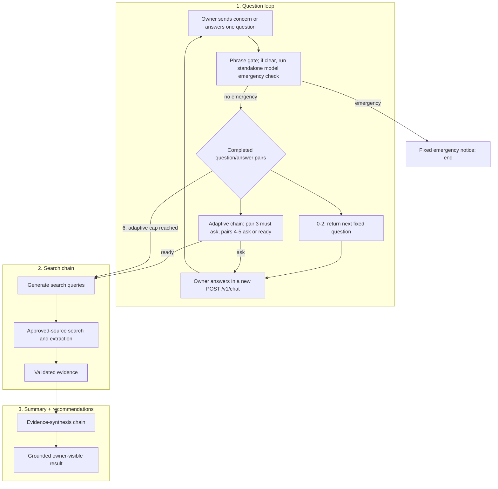

# Backend core

This folder owns the ordered conversation, emergency routing, four LangChain/Ollama stages,
approved-source retrieval, grounding validation, and HTTP composition. Each turn is recorded in
MLflow by the separate [`../mlflow_tracking/`](../mlflow_tracking/README.md) package, which the chat
route in `app.py` calls.

| File | Owns |
| --- | --- |
| `questions.py` | Immutable three-question catalog and standard-stage lookup |
| `workflow.py` | Phase inference, emergency-first ordering, caps, orchestration, citation validation |
| `safeguards.py` | Curated warning-phrase matcher; imports nothing from the project |
| `schemas.py` | Request, chain output, evidence, assessment, result, limits, and error types |
| `model.py` | Four structured-output LangChain chains backed by one Ollama model, plus prompt loading |
| `approved_sources.py` | Source catalog loading and exact host/subdomain checks |
| `search.py` | Query privacy validation, web search, result filtering, bounded extraction |
| `app.py` | FastAPI routes, runtime dependency composition, MLflow wrapping, and optional browser-client hosting |
| `error_handling.py` | Stable public `422`, `503`, and `500` responses |
| `settings.py` | Environment-backed model, search, and timeout settings |

Three important inputs live outside this folder:

- `../../prompts/*.md` contains the versioned system and human templates loaded by `model.py`;
- `../../config/approved_sources.toml` is the machine-readable retrieval allowlist;
- `../mlflow_tracking/` wraps each `/v1/chat` call in one run and trace.

## Ordered flow



A **completed pair** means two adjacent history messages: an assistant question followed by the
owner's answer. Each request returns at most one question; the backend does not loop internally.
The client sends the answer in a new request, which starts again at the two emergency checks. Pairs
zero to two select the next fixed question. Pair three requires the first adaptive question; pairs
four and five allow the adaptive chain to ask or declare readiness; pair six goes directly to
search without another adaptive call. Failure exits are omitted from this overview: a required
model or search stage that fails ends the request with the shared `503` contract.

Every turn starts with the phrase gate; every turn that survives it then runs the model check before
anything else happens:

1. **The phrase gate** (`safeguards.py`): plain Python, no model. It scans only the concern and
   owner answers; assistant wording, search queries, retrieved content, and model output are
   excluded. A match ends the turn at once.
2. **The emergency-check chain**: one model call whose only job is to decide whether the
   owner-reported signs may need an emergency vet now. It runs on every unmatched turn from the
   first message, so it sees the concern before the first fixed question and the last answer before
   search. It catches what the phrase list misses: pet names ("Max collapsed"), contractions,
   misspellings, and signs the list does not name. When unsure it answers yes.

Both routes return the same application-owned notice, and neither can be lowered by another stage.
The follow-up question chain cannot raise an emergency; that is the check's job alone. Search never
decides an emergency. A failed check is a `503`, never a pass: a turn does not continue without its
emergency check.

## Phase inference and history

The backend stores no session. The client resends the complete accepted history on every turn, and
the backend infers the phase from zero to six completed question/answer pairs:

- pairs 1–3 are the fixed duration, previous-occurrence, and pattern questions; their assistant
  text must exactly match `STANDARD_QUESTIONS` in `questions.py`;
- pairs 4–6 are model-generated adaptive questions;
- pair 4—the first adaptive question and answer—is mandatory before search can start;
- after adaptive pairs 1 and 2, the adaptive chain may ask another question or return
  `ready_for_search`;
- after adaptive pair 3, the workflow goes straight to search without calling the adaptive chain.
  The code counts the follow-up questions, so the model is never asked for a fourth one. The phrase
  matcher still checks the third answer first.

History must alternate assistant then owner, end in an owner answer, stay within 12 messages, and
use non-blank bounded text. Requiring the exact standard prefix prevents accidental client drift,
but a stateless custom client can still alter later history.

## Chain boundaries

`model.py` exposes four methods over one configured local Ollama model:

```python
chains.check_for_emergency(turn)
chains.propose_adaptive_question(turn, mode)
chains.generate_search_plan(turn)
chains.synthesise_assessment(turn, evidence)
```

Runtime composition uses function calling for `gpt-oss:*`, including the default `gpt-oss:20b`,
because Ollama returns that family's structured results as tool calls. Other configured models keep
the JSON-schema structured-output method. If gpt-oss ignores a forced tool and writes schema JSON
in message content, the adapter validates that content against the same Pydantic model; malformed
or schema-invalid content still fails closed. If gpt-oss uses the known semantic labels `area`,
`action`, and `question` inside an otherwise valid assessment tool call, the adapter maps those
three labels to the shared `text` field and reruns the complete strict schema. No other field is
repaired. The gpt-oss reasoning effort is set to `low` so the 900-token generation bound remains
available for the typed answer; other models keep their default reasoning setting.

The emergency-check chain returns `EmergencyCheck(emergency: bool)` and nothing else on every turn
not ended by the phrase gate. The adaptive chain asks one question or indicates readiness. The first
call uses `question_required` and the next two use `question_or_ready`. Both modes permit a question;
only `question_or_ready` permits readiness. After the required first adaptive answer, an exact
case-insensitive repeat of an answered question is treated as readiness and proceeds to search; the
application does not show the repeat or invent a replacement. There is no adaptive call at the cap.
The query chain sees the answered history and returns one to three neutral queries. At
least one query must explicitly compare whether the main sign is normal/expected versus
concerning/abnormal. The synthesis chain runs after retrieval and receives bounded, untrusted
evidence blocks identified by source ID.

All four prompt files use `<!-- system -->` and `<!-- human -->` markers. `PromptFile.load` splits
on those markers, and `app.py` records each file's SHA-256 on every MLflow run. That makes the exact
prompt version used for a result inspectable without copying prompt text into configuration.

Retrieved pages are background references, not evidence that the animal has a condition. The
synthesis prompt requires a positive abnormal fact reported by the owner before it can choose
`possible_problem`, so pathology-oriented results alone cannot set the outcome.

The synthesis draft chooses only `possible_problem` or `nothing_flagged`. The workflow supplies the
owner-visible wording, requires possible areas only for `possible_problem`, validates citations for
all possible areas, suggested actions, and veterinarian questions, and resolves source metadata.
Suggested actions may include recording an episode or a low-risk practical step only when the
retrieved evidence supports it.

There is no automatic model retry. Provider parsing errors raised inside LangChain are classified
as invalid model output and returned as the shared service failure. The stage and reason are kept
internally: they go to the server log and onto the turn's MLflow run as the `failed_stage` and
`failure_reason` tags.

## Approved-source retrieval

The current search path is deliberately layered. The provider-side `site:` filter narrows results,
but only the local URL checks enforce the policy:

1. `generate_search_plan` returns one to three generated queries, each 3–120 characters. The model
   sees the species, concern, and answered history; the search adapter receives only the resulting
   `SearchPlan`, never the raw transcript.
2. Before network access, `query_is_safe` rejects URLs, email addresses, and phone-like values.
   The prompt also forbids names, addresses, quoted text, commands, and model-generated `site:`
   operators. This is data minimisation, not guaranteed anonymisation: the deterministic checker is
   intentionally limited to the three pattern types implemented in `search.py`.
3. The adapter prepends a parenthesised `OR` of every approved domain as `site:` terms. It then
   makes one `ddgs` call per generated query using the configured region, moderate safe search, and
   at most three raw results per query. The application adds these `site:` terms; the model does not.
4. Successful sibling-query results are kept if another query raises. The whole unchanged plan is
   repeated once, after 0.25 seconds, only when **every** provider call raised. If any call completed
   but the combined result list is empty, the outcome is `no_search_results` and there is no repeat.
5. Every raw candidate is checked locally. It must be HTTPS and its host must equal an approved
   domain or be a real subdomain; lookalike suffixes and credential-bearing URLs fail. Candidate
   URLs are canonicalised and deduplicated before fetch. Search-result snippets are not evidence.
6. `HttpPageFetcher` checks the allowlist before the first request and before every redirect, follows
   at most three redirects, accepts only text/HTML, rejects pages over 500,000 bytes, removes
   script/style/navigation/form-like content, compacts whitespace, and keeps at most 4,000
   characters. A fetch or parse failure discards only that candidate.
7. The adapter keeps the first four usable pages and assigns `S1`, `S2`, and so on in accepted
   order. A missing result title falls back to the final URL path or the approved organisation.
   Zero raw results produces `no_search_results`; raw results but zero usable pages produces
   `insufficient_evidence`.
8. The synthesis model cites these IDs, not URLs. `workflow.py` rejects unknown IDs, then resolves
   accepted IDs back to the retrieved title, organisation, and URL. Only referenced sources are
   returned to the client.

See [`../../documentation/approved-sources.md`](../../documentation/approved-sources.md) for the
source policy and privacy boundary.

## Limits at a glance

| Boundary | Current limit | Enforced in |
| --- | ---: | --- |
| Emergency checks | phrase gate every turn; one model check if the gate does not match | `safeguards.py`, `workflow.py` |
| Standard questions | exactly 3 before adaptive questioning | `questions.py`, `workflow.py` |
| Adaptive questions answered | minimum 1, maximum 3 before search | `workflow.py`, `schemas.py` |
| Complete history | maximum 6 pairs / 12 messages | `schemas.py` |
| Concern or history message | 1,000 characters | `schemas.py` |
| Generated adaptive question | 500 characters | `schemas.py` |
| Search plan | 1–3 queries; 3–120 characters each | `schemas.py` |
| Raw search results | at most 3 per query | `search.py` |
| Provider attempts | 2 plan attempts, only after total provider failure | `search.py` |
| Redirects / fetched page / excerpt | 3 / 500,000 bytes / 4,000 characters | `search.py` |
| Evidence sent to synthesis | at most 4 accepted pages | `search.py` |
| Possible areas / actions / vet questions | 0–3 / 1–4 / 1–3 | `schemas.py` |
| Citations on each grounded item | 1–4 source IDs | `schemas.py` |

## Error type → action matrix

| Error or outcome | Backend action | Owner-visible action | Automatic retry? | Default response / alternative wording? |
| --- | --- | --- | --- | --- |
| Invalid/missing intake | Stop before workflow/model/search | `422`, correct field | No | Field correction only |
| Blank/overlong answer | Stop at request validation | `422`, edit answer | No | Field correction only |
| Odd/out-of-order/over-limit history | Raise `InvalidTurnRequest` | `422`, correct/restart history | No | Stable history message |
| Wrong standard-question prefix | Reject altered/skipped phase | `422`, correct/restart history | No | No inferred replacement |
| Emergency phrase in owner text | Return fixed notice; skip all later work | `200 emergency_notice`; end | No | Fixed application text |
| Emergency-check chain answers true | Return the same fixed notice; skip every later stage | `200 emergency_notice`; end | No | Model supplies no owner-visible wording |
| Emergency-check chain fails, times out, or returns malformed output | Raise `ModelOutputError` with stage `emergency_check`; never treat it as "no emergency" | Same `503`, preserve draft, **Try again** | No | No question is shown without a completed check |
| Standard-question stage | Return next catalog item, after both emergency checks | `200 question` | N/A | Exact deterministic wording |
| Required first adaptive call says ready | Raise `ModelOutputError(invalid_model_output)` | `503`, preserve draft, **Try again** | No | No substitute question |
| Malformed/blank/overlong adaptive output | Reject it | Same `503` | No | Raw output hidden |
| Later adaptive call exactly repeats an answered question | Treat the completed history as ready and continue to search | Continue to search | No | No repeated or substitute question shown |
| Model timeout | Raise `ModelOutputError(timeout)` | Same `503` | No | No default question/assessment |
| Ollama connection failure | Raise `ModelOutputError(connection)` | Same `503` | No | No alternate provider |
| Other provider failure | Raise `ModelOutputError(model_call_failed)` | Same `503` | No | No automatic rephrasing |
| Three adaptive answers complete | Go straight to search; the adaptive chain is not called | Continue to search | No | No fourth question can be requested |
| Invalid/unsafe search plan | Reject before external call when possible | `503`, preserve draft | No | Transcript is never used as fallback query |
| One query fails but another returns raw results | Keep raw results and continue allowlist/fetch validation | Continue if approved evidence remains | No additional retry | No unsourced response |
| Every provider call fails | Repeat the exact plan once; then raise `ModelOutputError(search_failed)` if it fails again | Same `503` | One bounded repeat only | No rephrasing, provider swap, or unsourced response |
| At least one provider call completes but the plan returns no raw results, including when a sibling call fails | Raise `ModelOutputError(no_search_results)` | Same `503` | No | No unsourced response |
| HTTP/off-list/malformed/redirected result | Discard result | No direct message if other evidence works | No | Never sent to synthesis |
| Individual approved fetch/parse failure | Discard page | Continue only with remaining evidence | No | No second search |
| Raw results but no approved evidence | Skip synthesis; raise `insufficient_evidence` | `503`, preserve draft | No | No model-only causes |
| Malformed synthesis | Reject it | `503`, preserve draft | No | No partial assessment |
| Unknown source ID, contradictory outcome, or uncited grounded item | Reject grounding | Same `503` | No | No invented citation or model-authored outcome wording |
| Synthesis timeout/provider failure | Stop turn | Same `503` | No | No partial/default assessment |
| Unexpected exception | Log stage/reason, return safe body | `500`, preserve draft | No | No diagnostics exposed |
| Successful question | Return and commit only at client on success | Show assistant bubble | N/A | No extra text |
| Successful assessment | Build the labelled owner recap from owner-authored input, resolve sources, add fixed outcome wording and disclaimer, end | Show structured result + **New concern** | N/A | Synthesis cannot author the recap; retrieved sources only |

**Retry means another application-level search invocation.** After a total provider failure, the
search adapter performs one bounded repeat of the exact same plan. The configured `ddgs` client's
`auto` mode may also try multiple engines internally during either invocation. Filtering returned
results or keeping successful sibling-query results is not a retry. The backend makes no hidden
corrective model call, rephrasing call, or provider swap. A technical failure never triggers
model-authored reassurance, a diagnosis, or a fabricated source. Any later retry is an explicit
owner action in a client.

The longer narrative version of this contract is
[`../../documentation/failure-handling.md`](../../documentation/failure-handling.md).

## Public errors

Every handled model, query, search, evidence, or synthesis failure returns the same safe `503` body.
Internal reasons are logged without owner text, and recorded as tags on the turn's MLflow run.
Invalid schema or history returns a compact `422` issue. Unexpected errors return the same safe
wording with `500`. An MLflow failure never changes the reply: if MLflow cannot open a run, the
turn is answered anyway with `run_id: null`, and any failed MLflow write is logged and skipped.

Both clients retain the current answer after any non-success. The backend never knows whether the
owner will manually retry.

## HTTP and observability boundary

- `GET /health` returns `{"status": "ok"}` without calling a model or search.
- `POST /v1/chat` validates `TurnRequest`, executes `run_turn` inside one MLflow run, excludes the
  internal `emergency_rule` from the public payload, and adds the successful run's `run_id`.
- Failed turns are still marked failed in MLflow with `failed_stage` and `failure_reason`, but public
  error responses currently use `"run_id": null`.
- If `src/frontend/public/dist/` exists, it is mounted last at `/`. Mounting it last preserves
  `/v1/chat`, `/health`, and FastAPI's `/docs`; serving the browser and API from one origin avoids a
  separate CORS policy.
- MLflow traces include owner text, generated queries, model inputs/outputs, and evidence excerpts.
  See [`../mlflow_tracking/README.md`](../mlflow_tracking/README.md) for storage and deletion rules.

## Verification map

- `tests/test_workflow.py` covers the fixed/adaptive phase boundary, required first adaptive answer,
  cap decision, emergency short-circuits, and stage order.
- `tests/test_search.py` covers query scoping, URL enforcement, deduplication, partial failures, the
  total-failure-only repeat, and the distinction between no raw results and no usable evidence.
- `tests/test_model_output.py` covers malformed structured output, outcome invariants, and unknown or
  missing source IDs.
- `tests/test_api.py` and `tests/test_error_contracts.py` cover public success/error shapes and
  confirm that failed stages do not call later ones.
- `tests/test_mlflow_tracking.py` covers one run per turn, failed-run tags, prompt/reply traces, and
  concurrent-run trace ownership.

Run the deterministic backend-focused suite from the repository root with:

```powershell
uv run pytest tests/test_workflow.py tests/test_search.py tests/test_model_output.py `
  tests/test_api.py tests/test_error_contracts.py tests/test_mlflow_tracking.py -q
```
