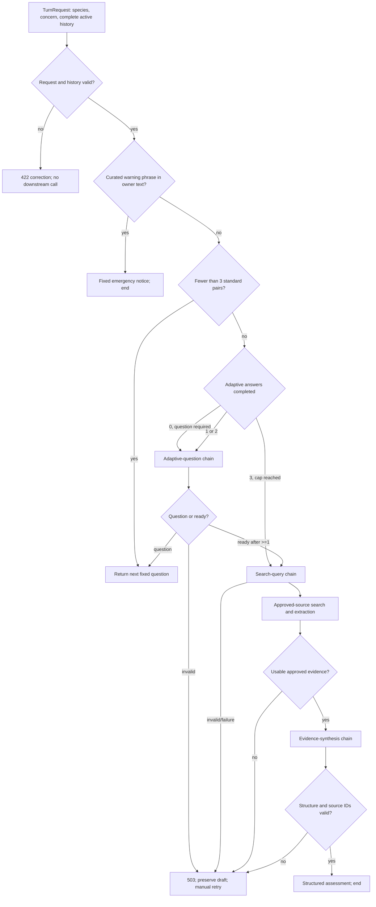

# Backend core

This folder owns the ordered conversation, emergency routing, three LangChain/Ollama stages,
approved-source retrieval, grounding validation, and HTTP composition. MLflow traceability is the
next milestone and is not implemented here yet.

| File | Owns |
| --- | --- |
| `questions.py` | Immutable three-question catalog and standard-stage lookup |
| `workflow.py` | Phase inference, emergency-first ordering, caps, orchestration, citation validation |
| `safeguards.py` | Curated warning-phrase matcher; imports nothing from the project |
| `schemas.py` | Request, chain output, evidence, assessment, result, limits, and error types |
| `model.py` | Three provider-specific LangChain/Ollama chains and prompt loading |
| `approved_sources.py` | Source catalog loading and exact host/subdomain checks |
| `search.py` | Query privacy validation, web search, result filtering, bounded extraction |
| `app.py` | FastAPI routes and runtime dependency composition |
| `error_handling.py` | Stable public `422`, `503`, and `500` responses |
| `settings.py` | Environment-backed model, search, and timeout settings |

## Ordered flow



The emergency gate always precedes deterministic questions, models, and search. Search never helps
decide an emergency. Only the concern and owner answers are scanned; assistant wording, search
queries, retrieved content, and model output are excluded.

## Phase inference and history

The backend stores no session. It infers phase from zero to six complete question/answer pairs:

- pairs 1–3 must exactly match `STANDARD_QUESTIONS` in `questions.py`;
- pairs 4–6 are adaptive;
- pair 4 is mandatory before search;
- after adaptive pairs 1 and 2, the adaptive chain may ask another question or return
  `ready_for_search`;
- after adaptive pair 3, the workflow goes directly to query generation.

History must alternate assistant then owner, end in an owner answer, stay within 12 messages, and
use non-blank bounded text. Requiring the exact standard prefix prevents accidental client drift,
but a stateless custom client can still alter later history.

## Chain boundaries

`model.py` exposes three methods over one configured local Ollama model:

```python
chains.propose_adaptive_question(turn, mode)
chains.generate_search_plan(turn)
chains.synthesise_assessment(turn, evidence)
```

The adaptive chain asks one question or indicates readiness. The first call uses
`question_required`; later calls use `question_or_ready`. The query chain sees the answered history
and returns neutral queries only. The synthesis chain runs after retrieval and receives bounded,
untrusted evidence blocks identified by source ID.

There is no automatic model retry. Provider parsing errors raised inside LangChain are classified
as invalid model output, returned as the shared service failure, and retained only as internal stage
metadata for future MLflow work.

## Approved-source retrieval

`search.py` sends only generated queries to the external search provider. It does not receive the
raw transcript. Queries are checked for common contact/URL patterns and bounded before use.
Results must use HTTPS and match a domain loaded from `config/approved_sources.toml`; redirects are
checked again. Off-list or unusable results are discarded. At least one evidence item is required.

The synthesis model cites IDs, not URLs. `workflow.py` rejects unknown IDs and resolves accepted IDs
back to the retrieved title, organisation, and URL. That prevents the model from inventing a source.

See [`../../documentation/approved-sources.md`](../../documentation/approved-sources.md) for the
source policy and privacy boundary.

## Error type → action matrix

| Error or outcome | Backend action | Owner-visible action | Automatic retry? | Default response / alternative wording? |
| --- | --- | --- | --- | --- |
| Invalid/missing intake | Stop before workflow/model/search | `422`, correct field | No | Field correction only |
| Blank/overlong answer | Stop at request validation | `422`, edit answer | No | Field correction only |
| Odd/out-of-order/over-limit history | Raise `InvalidTurnRequest` | `422`, correct/restart history | No | Stable history message |
| Wrong standard-question prefix | Reject altered/skipped phase | `422`, correct/restart history | No | No inferred replacement |
| Emergency phrase in owner text | Return fixed notice; skip all later work | `200 emergency_notice`; end | No | Fixed application text |
| Standard-question stage | Return next catalog item | `200 question` | N/A | Exact deterministic wording |
| Required first adaptive call says ready | Raise `ModelOutputError(invalid_model_output)` | `503`, preserve draft, **Try again** | No | No substitute question |
| Malformed/blank/overlong adaptive output | Reject it | Same `503` | No | Raw output hidden |
| Model timeout | Raise `ModelOutputError(timeout)` | Same `503` | No | No default question/assessment |
| Ollama connection failure | Raise `ModelOutputError(connection)` | Same `503` | No | No alternate provider |
| Other provider failure | Raise `ModelOutputError(model_call_failed)` | Same `503` | No | No automatic rephrasing |
| Attempted fourth adaptive question | Workflow cap prevents display and follows search path after third answer | No fourth question | No | Workflow, not model, chooses search |
| Invalid/unsafe search plan | Reject before external call when possible | `503`, preserve draft | No | Transcript is never used as fallback query |
| Search timeout/rate limit/provider error | Raise `ModelOutputError(search_failed)` | Same `503` | No | No unsourced response |
| HTTP/off-list/malformed/redirected result | Discard result | No direct message if other evidence works | No | Never sent to synthesis |
| Individual approved fetch/parse failure | Discard page | Continue only with remaining evidence | No | No second search |
| No approved evidence | Skip synthesis; raise `insufficient_evidence` | `503`, preserve draft | No | No model-only causes |
| Malformed synthesis | Reject it | `503`, preserve draft | No | No partial assessment |
| Unknown source ID or uncited grounded item | Reject grounding | Same `503` | No | No invented citation |
| Synthesis timeout/provider failure | Stop turn | Same `503` | No | No partial/default assessment |
| Unexpected exception | Log stage/reason, return safe body | `500`, preserve draft | No | No diagnostics exposed |
| Successful question | Return and commit only at client on success | Show assistant bubble | N/A | No extra text |
| Successful assessment | Resolve sources, append fixed disclaimer, end | Show five sections + **New concern** | N/A | Retrieved sources only |

**Retry means another provider/network invocation. Filtering several results from one completed
search is not a retry.** The backend makes no hidden corrective call, alternate-model call, or
automatic alternative-phrasing call. A technical failure never triggers model-authored reassurance,
a diagnosis, or a fabricated source. The only retry is an explicit owner action in the desktop.

The longer narrative version of this contract is
[`../../documentation/failure-handling.md`](../../documentation/failure-handling.md).

## Public errors

Every handled model, query, search, evidence, or synthesis failure returns the same safe `503` body.
Internal reasons are logged without owner text and will later be captured by MLflow. Invalid schema
or history returns a compact `422` issue. Unexpected errors return the same safe wording with `500`.

The desktop retains the current answer after any non-success. The backend never knows whether the
owner will manually retry.
