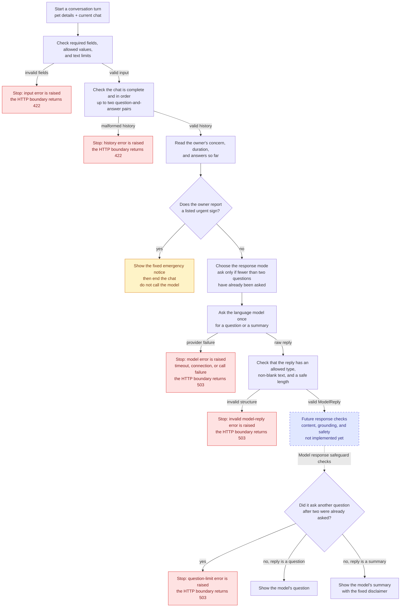

# Backend core

This folder is the decision-making core of the demo. The HTTP boundary is implemented; settings
and tracking are not written yet.

| File | Owns |
| --- | --- |
| `workflow.py` | The rules for one turn, and the two fixed strings the owner may see. |
| `safeguards.py` | Which phrases count as a warning sign. Imports nothing from the project. |
| `schemas.py` | The shapes a turn is made of, the length limits, and the two error types. Decides nothing. |
| `model.py` | Everything provider-specific: the prompt file and the LangChain/Ollama adapter. |
| `app.py` | Wires the FastAPI routes to the workflow, and exposes the Uvicorn `app` object. |
| `error_handling.py` | The public HTTP responses for request, model, and unexpected failures. |
| `settings.py` | Reads and validates the three backend launch environment variables. |
| `tracking.py` | Not written yet: MLflow. |

## Backend design and conversation flow

The diagram shows the implementation as it exists today. Red paths end the turn with a raised
error; amber paths return the fixed emergency notice. The dashed box marks the intended place for
a later response-validation block. It is not implemented and does not currently affect a reply.



The current validation block is `ModelReply.model_validate(raw)`: it only checks the reply's
shape. The later block belongs immediately after it, before the backend returns a question or
summary. That keeps content checks out of the model adapter and ensures they run for every normal
model reply. The emergency path remains separate because it returns fixed wording without asking
the model.

## What happens when a turn fails

The model is called once for an ordinary turn. There is no automatic retry and no default
model-written response. If the model times out, cannot be reached, raises another exception, or
returns a reply with the wrong shape, the backend raises a `ModelOutputError` and stops the turn.
It also raises one when the model tries to ask a third follow-up question.

Invalid intake or chat history stops earlier with `InvalidTurnRequest`; the HTTP boundary turns
these into `422` responses. It maps every `ModelOutputError` to the same safe `503` service-error
body and unexpected application failures to the same safe body with `500`. The backend never shows
an unvalidated model reply or silently substitutes reassurance after a failure.

## One turn, start to finish

`run_turn(turn, model)` in [`workflow.py`](workflow.py) is the whole flow, and it reads top to
bottom:

1. **Check the history.** Zero, one, or two complete question-and-answer pairs, alternating,
   assistant first. Anything else raises `InvalidTurnRequest`. It is rejected rather than trimmed,
   because the number of assistant messages in it is the follow-up count the cap is counted from.
2. **Scan the owner's words.** The concern, the duration box if it is not `unknown`, and every
   owner answer so far — never the assistant's own questions. If a curated phrase matches, the
   turn returns the fixed emergency notice with the rule's name attached, and the model is not
   called at all.
3. **Decide whether another question is allowed.** `may_ask_another` is true until two questions
   have been asked. It picks the mode the model is asked in, and it is read again after the reply.
4. **Make one model call.** `_ask_model` is the only place a provider is touched. It turns any
   exception into `ModelOutputError` and validates the answer against `ModelReply`. No retry, and
   no substitute text on failure.
5. **Apply the ending rules.** A question when `may_ask_another` is false is refused
   (`question_limit_violation`) rather than shown. A recap gets the fixed suffix appended.

Validation checks structure only: an allowed `kind`, and a non-blank reply within the length
limit. Nothing here judges whether a reply is relevant, factual, or medically sensible.

## Where to change a rule

| To change | Edit |
| --- | --- |
| The emergency phrases, or how denials and subjects are handled | `EMERGENCY_RULES` and the two helpers in `safeguards.py` |
| Which text is scanned for them | `_owner_written_text` in `workflow.py` |
| How many follow-up questions are allowed | `MAX_FOLLOW_UP_QUESTIONS` in `schemas.py` |
| The emergency notice or the recap suffix | `EMERGENCY_NOTICE` / `SUMMARY_SUFFIX` in `workflow.py` |
| What a model is allowed to answer | `ModelReply` in `schemas.py` |
| The prompt's wording, or the per-mode instruction | `prompts/question_flow.md`, `MODE_INSTRUCTIONS` in `model.py` |
| Model tag, URL, temperature, seed, timeout | the `OllamaChatModel` constructor arguments |

## Boundaries worth knowing

**Policy and provider are separate on purpose.** `workflow.py` decides *whether* to call a model
and *which mode* it may answer in; `model.py` decides *how* to say that to Ollama. The whole
contract between them is one method call, in `_ask_model`:

```python
raw = model.propose(turn, mode)
```

`workflow.py` imports nothing from `model.py` at all, not even a type, which is why neither it nor
its tests ever load LangChain. Anything with a `propose(turn, mode)` method works: the Ollama
adapter in production, the stand-in in the tests. Swapping in a different provider means writing
one class with one method and touching no rule.

There is deliberately **no interface class** describing that method. Nothing in this repository
checks type annotations — `pyproject.toml` runs ruff and no type checker — so a `Protocol` here
would be a comment with a `class` keyword on it, and one more thing to read before reaching the
code that decides something.

**`safeguards.py` stands alone.** It imports nothing from the project, because what counts as a
warning phrase does not depend on how a turn is run. It is phrase matching, not triage: it can
miss a real emergency and it can fire on misleading wording.

**`schemas.py` is the dependency root.** It imports nothing from the project and nothing from
LangChain, so the workflow's tests run without a model library installed. The layering is
`schemas.py` <- `model.py` <- `workflow.py`, with `safeguards.py` off to one side.

**`OllamaChatModel` reads no configuration.** The model tag, URL, temperature, seed, timeout,
prompt, and structured-output method are all constructor arguments. `BackendSettings` supplies the
model tag, URL, and timeout only when Uvicorn imports `backend.app:app`; tests instead call
`create_app` with a fake model. A tracking layer can read `model.prompt.sha256` and the model tag.
`PromptFile.load` hashes the whole prompt file, so any edit to it shows up as a different hash.

**The follow-up count is only as honest as the caller.** It is counted from the history the client
sent, so a custom client could rewrite it. That is a known consequence of having no server-side
session, not an oversight — see the
[implementation plan](../../documentation/implementation-plan.md).
